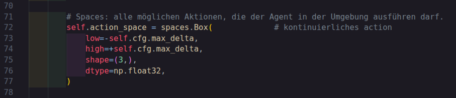
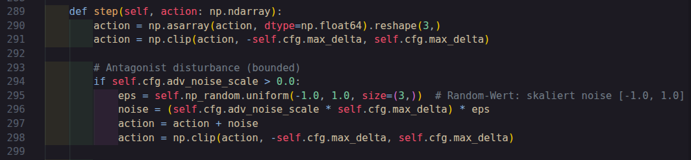
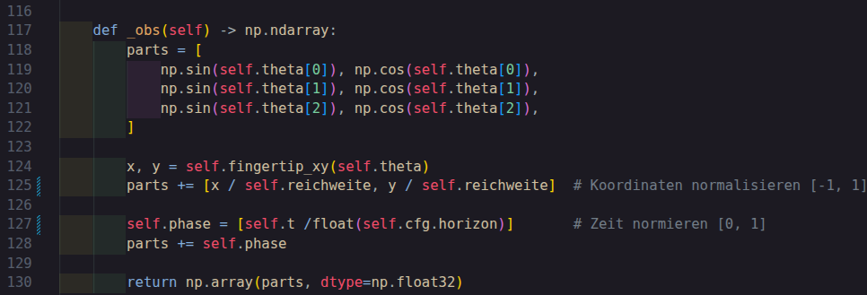
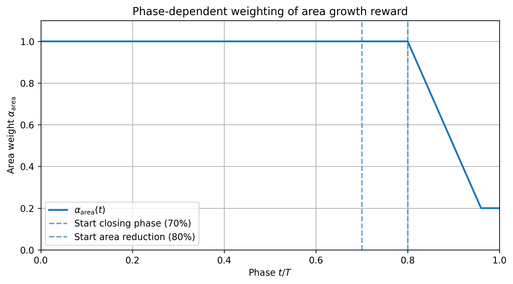
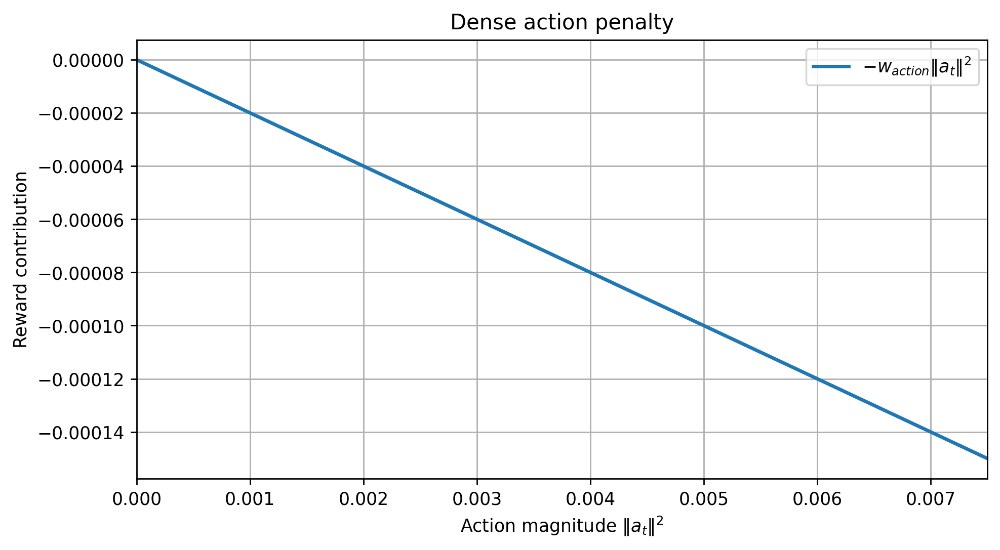
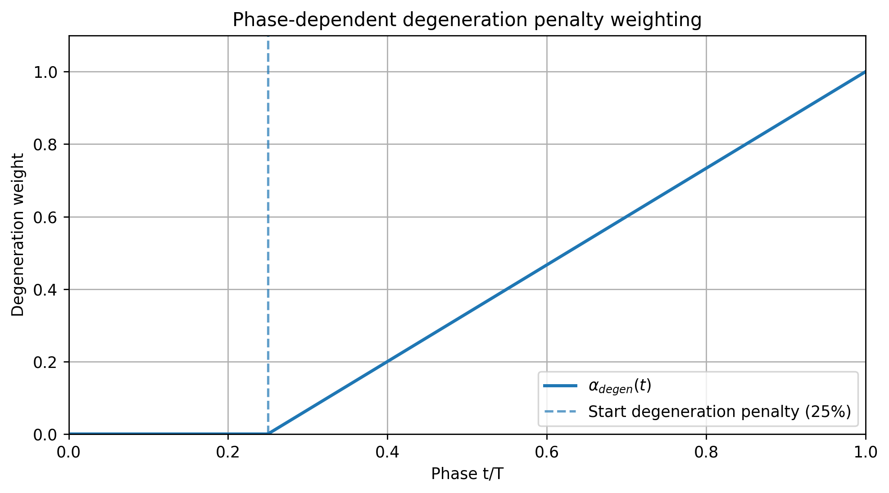
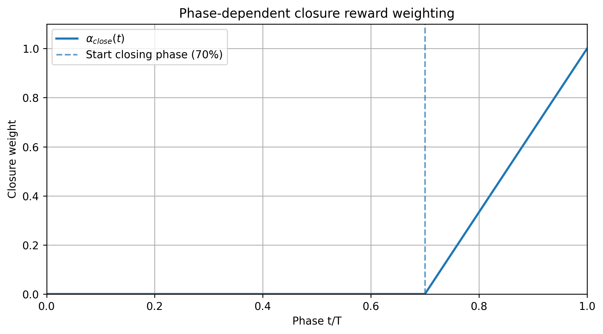
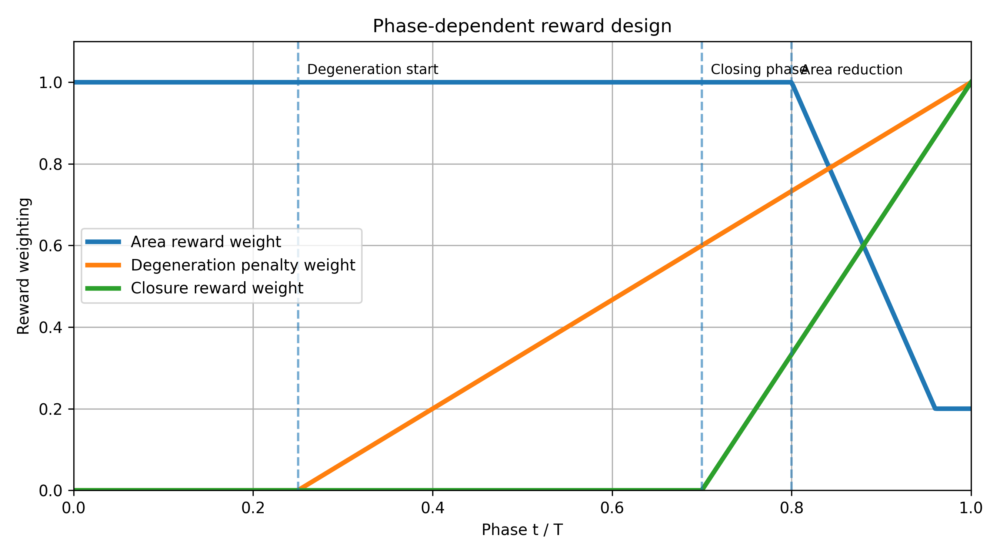

# Anthropomorphic Finger: Largest Ellipse(Actor-Critic with Antagonist) 

Der Fokus liegt auf einem kontinuierlichen Actor-Critic-Algorithmus für das Environment `FingerEllipseEnv`, in dem der Finger eine große, nicht-degenerierte Ellipsen-Trajektorie lernen soll.

---

## 1) Ziel des Projektes

- hohe finale Ellipsenfläche,
- gute Schließung der Trajektorie,
- nicht-degenerierte Ellipse (Achsenverhältnis),
- robust gegenüber antagonistischer Störung (`adv_noise_scale`).

---

## 2) Verzeichnisüberblick

```text
scripts/
├── __init__.py
├── finger_env.py                 # Gymnasium-Environment + Reward + Render
├── actor_critic.py               # Actor/Critic Modelle
├── train.py                      # Single-Env Training
├── rollout.py                    # Single-Env Rollout
├── evaluate.py                   # Modell laden, evaluieren, rendern
├── visualize_results.py          # Lernkurven/Robustheit/Trajektorie/ plotten
├── res/
├── requirements.txt

```

---

## 3) Usage
### Schritt 0 - Voraussetzungen

- Python 3.10+ (empfohlen)
- PyTorch
- Gymnasium
- NumPy
- Matplotlib
```bash
pip install -r scripts/requirements.txt
```

### Schritt 1 – Environment-Konfiguration

Die zentralen Environment-Parameter stehen in `scripts/finger_env.py` in `EnvConfig`:

| Parameter | Wert | Bedeutung |
|---|---:|---|
| `device` | `cuda:0` falls verfügbar, sonst `cpu` | Rechen-Device für Tensoren/Modelle. |
| `l1` | `5.0` | Länge Link 1 in cm. |
| `l2` | `2.5` | Länge Link 2 in cm. |
| `l3` | `2.5` | Länge Link 3 in cm. |
| `theta_min` | `-π/2` | Untere Gelenkgrenze in rad. |
| `theta_max` | `+π/2` | Obere Gelenkgrenze in rad. |
| `horizon` | `256` | Episodenlänge (maximale Schritte pro Episode). |
| `max_delta` | `0.05` | Max. Gelenkwinkel-Änderung pro Step in rad (≈ 2.8°). |
| `k_axis` | `1.0` | Skalenfaktor für PCA-Ellipsenachsen. |
| `w_area` | `1.0` | Gewicht für Flächenanteil im dense Reward (im aktuellen Reward-Code nicht explizit multipliziert). |
| `w_close` | `0.05` | Gewicht der terminalen Closure-Strafe. |
| `w_close_dense` | `0.05` | Gewicht des dense Closure-Terms während der Episode. |
| `w_degen` | `0.1` | Gewicht der terminalen Degenerationsstrafe (kleines Achsenverhältnis). |
| `w_degen_dense` | `0.01` | Gewicht der dense Degenerationsstrafe während der Episode. |
| `w_action` | `0.02` | Gewicht der Aktionsenergie-Strafe (`||a||²`) pro Step. |
| `min_axis_ratio` | `0.35` | Mindestwert für `b/a` (Ellipse), darunter greift Degenerations-Hinge. |
| `adv_noise_scale` | `0.25` | Stärke der antagonist. Störung relativ zu `max_delta`; effektive Noise-Amplitude = `adv_noise_scale * max_delta` (`0.0125` rad). |

Für reproduzierbare Experimente solltest du diese Parameter pro Run mitprotokollieren (z. B. im Checkpoint-Namen oder in einer Run-Config).

### Schritt 2 – Training starten (Single-Env)

Datei: `scripts/train.py`

Dort werden oben im Skript die wichtigsten Laufparameter gesetzt:
- `EPISODEN`
- `MODE` (`"NEU"` oder `"RESUME"`)
- ggf. `RESUME_PATH`
- Lernraten / Entropy / Value-Koeffizient

Start:

```bash
python scripts/train.py
```

Output (in `checkpoints/...`):
- `best_by_eval_return.pt`
- `best_by_eval_area.pt`
- `last_model.pt`
- `training_log.pt`
- `training_curve_return.png`
- `training_curve_area.png`
- `training_curve_losses.png`
- `training_curve_entropy.png`


Die Logik ist analog zu `train.py`, aber mit vectorized Rollouts (`AsyncVectorEnv`) und effektiven Episodenachsen.

### Schritt 3 – Modell evaluieren oder rendern

Datei: `scripts/evaluate.py`

Oben im Skript einstellen:
- `MODE = "render"` oder `"eval"`
- Checkpoint-Pfade
- Noise-Level-Liste (`adv_noise_scale`)

Start:

```bash
python scripts/evaluate.py
```

- `render`: spielt 1 Episode mit dem Envornment sichtbar (`render_mode="human"`)
- `eval`: mehrere Noise-Stufen und Ausgabe von Return/Area/Closure/Axis Ratio

### Schritt 5 – Ergebnisse visualisieren

Datei: `scripts/visualize_results.py`

Start:

```bash
python scripts/visualize_results.py
```

Erzeugt folgndes Plotts:
- finale Trajektorie + PCA-Ellipse,
- Lernkurven aus `training_log.pt` (oder aus gespeicherten PNGs),
- Robustheitsplots gegen `adv_noise_scale`.

---

## 4) Prjektstruktur und Komponenten

### 1  `finger_env.py`

`FingerEllipseEnv` ist ein kontinuierliches Gymnasium-Environment für einen planaren 3R-Finger.
Ziel ist eine große, geschlossene und nicht-degenerierte Endeffektor-Trajektorie (Ellipse-ähnlich).

- **Fläche maximieren:** Die Trajektorie soll eine große Ellipsenfläche aufspannen.
- **Schließung erzwingen:** Start- und Endpunkt sollen nahe beieinander liegen.
- **Degeneration vermeiden:** Die Ellipse soll nicht zu „flach“ werden (`b/a` nicht zu klein).
- **Störrobustheit:**  antagonistisches Rauschen auf Aktionen.

#### EnvConfig

Die zentralen Environment-Parameter stehen in `scripts/finger_env.py` in der Klasse `EnvConfig`:

| Parameter | Wert | Bedeutung |
|---|---:|---|
| `device` | `cuda:0` falls verfügbar, sonst `cpu` | Rechen-Device für Tensoren/Modelle. |
| `l1` | `5.0` | Länge Link 1 in cm. |
| `l2` | `2.5` | Länge Link 2 in cm. |
| `l3` | `2.5` | Länge Link 3 in cm. |
| `theta_min` | `-π/2` | Untere Gelenkgrenze in rad. |
| `theta_max` | `+π/2` | Obere Gelenkgrenze in rad. |
| `horizon` | `256` | Episodenlänge (maximale Schritte pro Episode). |
| `max_delta` | `0.05` | Max. Gelenkwinkel-Änderung pro Step in rad (≈ 2.8°). |
| `k_axis` | `1.0` | Skalenfaktor für PCA-Ellipsenachsen. |
| `w_area` | `1.0` | Gewicht für Flächenanteil im dense Reward (im aktuellen Reward-Code nicht explizit multipliziert). |
| `w_close` | `0.05` | Gewicht der terminalen Closure-Strafe. |
| `w_close_dense` | `0.05` | Gewicht des dense Closure-Terms während der Episode. |
| `w_degen` | `0.1` | Gewicht der terminalen Degenerationsstrafe (kleines Achsenverhältnis). |
| `w_degen_dense` | `0.01` | Gewicht der dense Degenerationsstrafe während der Episode. |
| `w_action` | `0.02` | Gewicht der Aktionsenergie-Strafe (`||a||²`) pro Step. |
| `min_axis_ratio` | `0.35` | Mindestwert für `b/a` (Ellipse), darunter greift Degenerations-Hinge. |
| `adv_noise_scale` | `0.25` | Stärke der antagonist. Störung relativ zu `max_delta`; effektive Noise-Amplitude = `adv_noise_scale * max_delta` (`0.0125` rad). |

#### Action Space

- Typ: `Box(shape=(3,), dtype=float32)`
- Bereich je Gelenk: `[-max_delta, +max_delta]`
- Bedeutung: Aktion ist **Gelenkwinkel-Delta pro Step** in rad.



Im `step()`:
1. Aktion wird auf `[-max_delta, +max_delta]` geclippt.
2. Optionales Noise wird addiert (`adv_noise_scale * max_delta * U[-1,1]`) und erneut geclippt.
3. Gelenkwinkel werden aktualisiert und auf `[theta_min, theta_max]` geclippt.



#### Observation Space

- Typ: `Box(shape=(9,), low=-1, high=1, dtype=float32)`
- Struktur (Reihenfolge):

| Index | Feature | Beschreibung |
|---:|---|---|
| 0 | `sin(theta1)` | Sinus von Gelenk 1 |
| 1 | `cos(theta1)` | Cosinus von Gelenk 1 |
| 2 | `sin(theta2)` | Sinus von Gelenk 2 |
| 3 | `cos(theta2)` | Cosinus von Gelenk 2 |
| 4 | `sin(theta3)` | Sinus von Gelenk 3 |
| 5 | `cos(theta3)` | Cosinus von Gelenk 3 |
| 6 | `x_norm` | Endeffektor-x, normiert mit `l1+l2+l3` |
| 7 | `y_norm` | Endeffektor-y, normiert mit `l1+l2+l3` |
| 8 | `phase` | normierte Zeit `t/horizon` |




#### Geometriebasis (Ellipse aus Punktwolke)

Aus der bisherigen Trajektorie wird über die Kovarianzmatrix $\Sigma$ eine PCA-Ellipse geschätzt:

$$
A = \pi \cdot k_{axis}^2 \cdot \sqrt{\det(\Sigma)}
$$

Dabei sind $a, b$ die Halbachsen und `axis_ratio = b/a`.
`k_axis` aus `EnvConfig` hat standardmäßig den Wert **1.0**.

#### Reward-Funktion (Dense + Terminal)

Die Reward-Berechnung in `reward_function()` ist **phasenabhängig** und besteht aus Dense Terms pro Step plus terminaler Penalty am Episodenende.

##### 1) Dense Reward-Terme

**(a) Flächenterm (Area)**

$$
r_{area}(t)=\alpha_{area}(t)\cdot(A_t-A_{t-1})
$$

mit

$$
\alpha_{area}(t)=\max\left(0.2,\;1-\max\left(0,\frac{\text{phase}-0.8}{0.2}\right)\right)
$$


- Bis 80% der Episode: Gewicht gleich 1.0
- Danach linearer Abfall, aber nur bis 0.2



**(b) Aktionskosten (Action)**

$$
r_{action}(t)=w_{action}\cdot\|a_t\|^2
$$

Mit `w_action = 0.02` . Dieser Term wird vom Reward abgezogen.



**(c) Degenerationsstrafe (Degeneration)**

$$
	ext{hinge}=\max(0,\;\text{min\_axis\_ratio}-b/a)
$$

$$
r_{degen}(t)=w_{degen\_dense}\cdot\alpha_{degen}(t)\cdot\text{hinge}^2
$$

mit

$$
\alpha_{degen}(t)=\max\left(0,\frac{\text{phase}-0.25}{0.75}\right)
$$

Mit `min_axis_ratio = 0.35` und `w_degen_dense = 0.01`.




**(d) Closure-Term (Closure, späte Phase)**

$$
r_{close}(t)=w_{close\_dense}\cdot\alpha_{close}(t)\cdot(d_{t-1}-d_t)
$$

mit $d_t=\|p_t-p_0\|^2$ und

$$
\alpha_{close}(t)=\max\left(0,\frac{\text{phase}-0.7}{0.3}\right)
$$

Mit `w_close_dense = 0.05` .




**Gesamter Dense Reward:**

`reward_dense = r_area_dense - r_action_dense + r_close_dense - r_degen_dense`


**Interpretation (Phasenverlauf):**

Diese Grafik zeigt die zeitliche Struktur der Reward-Funktion während einer Episode.

- **Phase 0–25 %**
   - Der Agent konzentriert sich vollständig auf Flächenwachstum.
   - Area-Reward ist maximal.
   - Keine Degeneration-Strafe.
   - Keine Closure-Belohnung.
   - **Ziel:** Exploration großer Trajektorien.

- **Phase 25–70 %**
   - Die Degeneration-Strafe wird schrittweise aktiviert.
   - Das verhindert, dass die Trajektorie zu einer Linie degeneriert oder extrem gestauchte Ellipsen erzeugt.
   - Der Agent maximiert weiter Fläche, muss aber gleichzeitig eine gültige Ellipsenform erhalten.

- **Phase 70–80 %**
   - Die Closure-Belohnung beginnt.
   - Der Agent wird gefördert, zum Startpunkt zurückzukehren und die Trajektorie zu schließen.
   - Die Flächengewichtung ist weiterhin maximal.

- **Phase 80–100 %**
   - Die Flächengewichtung wird reduziert.
   - Dadurch verschiebt sich die Priorität: weniger Fokus auf zusätzliche Fläche, stärkerer Fokus auf das saubere Schließen der Ellipse.


Für die Gesamtübersicht der Phasen-Gewichte (`alpha_area`, `alpha_degen`, `alpha_close` 



##### 2) Terminale Penalty (nur im letzten Schritt)

Am Episodenende (`truncated` oder `terminated`) wird zusätzlich abgezogen:

$$
p_{close}=w_{close}\cdot\text{closure\_dist2}
$$

Mit `w_close = 0.05` .

$$
p_{degen}=w_{degen}\cdot\text{hinge}^2
$$

Mit `w_degen = 0.1` .

$$
	ext{terminal\_penalty}=p_{close}+p_{degen}
$$

Final im letzten Schritt:

`reward = reward_dense - terminal_penalty`


#### API-Verhalten (`reset` / `step`)

- `reset(seed=...)`
  - initialisiert zufällige Gelenkwinkel innerhalb Limits,
  - setzt interne Trajektorie auf Startpunkt,
  - gibt `(obs, info)` zurück.

- `step(action)`
  - führt Dynamik + Reward aus,
  - aktualisiert Trajektorie und Zeit,
  - gibt `(obs, reward, terminated, truncated, info)` zurück.

#### Rendering

- Bei `render_mode="human"` wird pro Step ein Matplotlib-Fenster aktualisiert.
- Gezeigt werden:
  - Finger-Glieder als Polyline,
  - Endeffektor-Trajektorie,
  - feste Achsenskalierung auf den Arbeitsraum `l1+l2+l3`.

### 2 `actor_critic.py`

- `Actor`: Gauß-Policy mit Tanh-Squashing
- `Critic`: state value function `V(s)`
- `choose_action(...)` liefert gesampelte Aktion, Log-Prob und Entropie

### 3 `rollout.py`

- sammeln Trainingsdaten bei 256 Schritten bzw. einer Episode für Actor-Critic-Update

### 4 `train.py`

- Monte-Carlo Returns
- Advantage-Normalisierung
- getrennte Optimierer für Actor/Critic
- regelmäßige Evaluation via `evaluate(...)`
- Speichern von Best-/Last-Checkpoints + Trainingslog + Kurvenplots

### 5 `evaluate.py`
   Evaluiert eine Policy über bestimmte Anzahl von Episoden `EVALUATE_EPISODES_NUM = 50`
   mit einem bestimmten seed `SEED = 5
- lädt Checkpoint (`actor_state_dict`, `critic_state_dict`, `config`)
- spielt Episoden deterministisch über `tanh(mu)`
- aggregiert Metriken über mehrere Episoden

### 6 `visualize_results.py`

- Lernkurven aus Logs
- Trajektorie inkl. PCA-Ellipse
- Robustheit über Noise-Level

---


## 5) Häufige Errors

1. **Falscher `MODE` im Training**
   - In `train.py` muss `MODE` exakt `"NEU"` oder `"RESUME"` sein.

2. **Ungültiger Checkpoint-Pfad bei Resume/Eval**
   - Prüfe `RESUME_PATH` bzw. Pfade in `evaluate.py`.

3. **Render funktioniert nicht auf Headless-System**
   - `render_mode="human"` braucht grafische Oberfläche.

4. **Importprobleme beim direkten Ausführen aus Unterordnern**
   - Skripte vom Projekt-Root aus starten (`python scripts/...`).

5. **Unklare Vergleichbarkeit von Runs**
   - Konfigurationen, Seeds und Noise-Level pro Run protokollieren.
